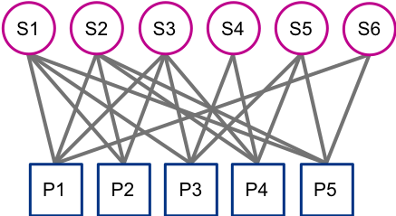
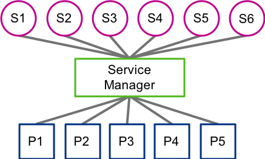
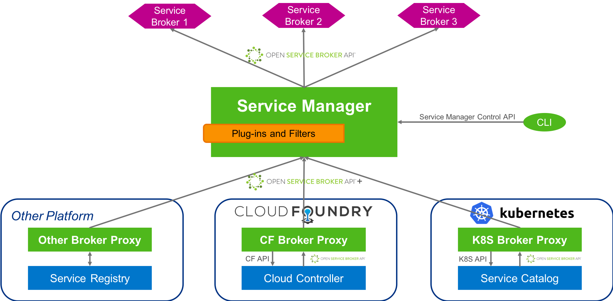

# Overview

An overview on the motivation on creating the Service Manager as well as very high-level architecture.

## Motivation

With Cloud Landscapes becoming bigger and more diverse, managing services is getting more difficult and new challenges arise:

* Cloud providers are facing an increasing number of Platform Types, Platform Instances, supported IaaS and regions.
At the same time, the number of services is increasing.
Registering and managing a big amount of service brokers at a huge number of Platform Instances is infeasible.
A central, Platform Instance independent component is needed to allow a sane management of service brokers.

* So far, service instances are only accessible in the silo (platform) where they have been created.
But there are use-cases that require sharing of a service instance across platforms.
For example, a database created in Kubernetes should be accessible in Cloud Foundry.

A standardized way is needed for managing service broker registrations and propagating them to the registered Platform Instances when necessary.
Also there should be a mechanism for tracking service instances creation that allows sharing of service instances across Platform Instances.

## High-level Architecture

The Service Manager is based on the Open Service Broker API , an open standard for provisioning and deprovisioning service instances and binding service instances to applications.

### Open Service Broker API

The [Open Service Broker (OSB) specification](https://github.com/openservicebrokerapi/servicebroker) defines an HTTP(S) interface between Platforms and Service Brokers. A Service Broker must exist for each service that wants to be part of the services infrastructure of a platform. The OSB API allows a platform programmatically to discover services and create and delete service instances and bind / unbind service instances to applications. This standardization enables platforms to handle all kinds of services without knowing the service details. The most popular platforms today make use of this interface are Cloud Foundry and Kubernetes. Platforms that don’t support OSB can be enhanced by exposing the services they offer by providing Service Brokers.

### Architecture

The Service Manager (SM) is an OSB-based solution that consists of multiple parts.

#### Service Manager Core

The main part is the core component.
It is the central registry for service broker and platform registration, as well as for tracking of all service instances.
This core component communicates with the registered service brokers and acts as a platform per OSB specification for them.

#### Service Manager CLI

Service Manager provides a command line interface (CLI) to manage service broker and platform registrations. In the future the CLI will support also management of service instances, so it will be possible to create and use a service instances outside of any platform (a.k.a. out-of-platform provisioning).

#### Service Broker Proxies

In each Platform Instance resides a component called the Service Broker Proxy.
It is the substitute for all brokers registered at the Service Manager in order to replicate broker registration and access visibility changes in the corresponding Platform Instance. It also  delegates lifecycle operations to create/delete/bind/unbind service instances from the corresponding Platform Instance to the Service Manager and the services registered there. Therefore, the Service Manager also acts as a Service Broker for the Platform Instances that are registered in it.

#### Flow

When a service broker is registered or deregistered with the Service Manager, the Service Broker Proxy registers or deregisters itself with the Platform Instance on behalf of this service broker. From a Platform Instance point of view, the broker proxy is indistinguishable from the real broker because both implement the OSB API.

When the Platform Instance makes a call to the service broker, for example to provision a service instance, the broker proxy accepts the call, forwards it to the Service Manager OSB API, which in turn forwards it to the real broker.
The response follows the same path back to the Platform Instance.
Because all OSB calls go through the Service Manager, it can track all service instances and share them between Platform Instances.

The Service Manager can also enforce different policies at a central place, e.g. visibility restrictions (which service brokers, services and plans should be visible in which platform), quota checks (e.g. amount of instances of a particular service and plan that a customer can create/use), etc. To achieve this, the Service Manager can be extended with custom logic via plugins.

When a service broker is registered or deregistered with the Service Manager or any visibility policies are enforced the Service Manager has to replicate this desired state in some Platform Instance(s). In order to achieve this, the Service Manager forwards this information to the corresponding Service Broker Proxy that runs in this Platform Instance. After that the Service Broker Proxy knows how to interpret this information in the context of this Platform Instance and by using the provided Platform Instance APIs it tries to reconcile the desired state provided by the Service Manager with the current state in the Platform Instance. One example might be when a new service broker has to be made available in the Platform Instance. When the Service Broker Proxy is informed about this event, it takes care to register itself with a specific URL in the Platform Instance, so that later on when the Platform Instance calls the proxy on that specific URL, it (the proxy) will know to forward the call to the Service Manager and include details about which actual service broker this OSB call is meant for.

## Benefits of the Solution

Service Manager dramatically simplifies the management of services and service instances in the scenarios with many platforms (or even many cloud providers). The fact, that the Service Manager is not bound to a specific platform and the use of an open API avoids an environment lock-in and therefore will also work with future platforms.

For many platforms (those who support the OSB API), the solution is completely transparent. All the native tools of those platforms just work without any modifications. None of the services related workflows in those platforms have to be changed.
