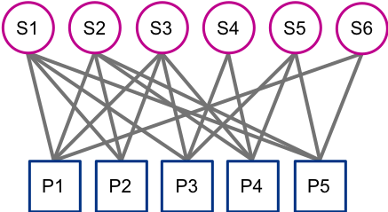
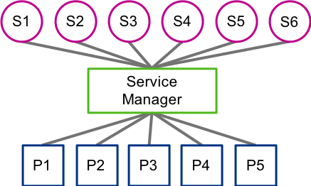
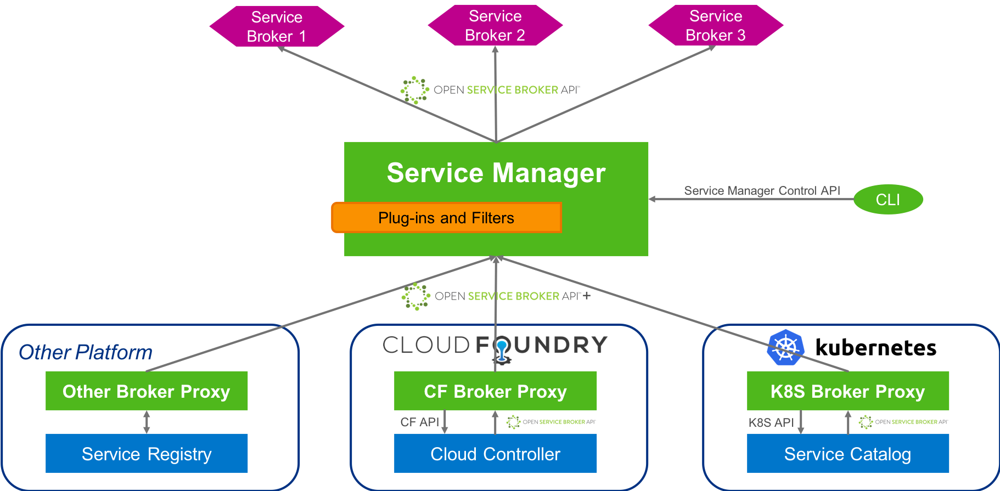

# Motivation

With Cloud Landscapes becoming bigger and more diverse, managing services is getting more difficult and new challenges arise:

* Cloud providers are facing an increasing number of Platform Types, Platform Instances, supported IaaS and regions.
At the same time, the number of services is increasing.
Registering and managing a big amount of service brokers at a huge number of Platform Instances is infeasible.
A central, Platform Instance independent component is needed to allow a sane management of service brokers.

* So far, service instances are only accessible in the silo (platform) where they have been created.
But there are use-cases that require sharing of a service instance across platforms.
For example, a database created in Kubernetes should be accessible in Cloud Foundry.

A standardized way is needed for managing service broker registrations and propagating them to the registered Platform Instances when necessary.
Also there should be a mechanism for tracking service instances creation that allows sharing of service instances across Platform Instances.

# Architecture

The Service Manager (SM) consists of multiple parts.
The main part is the core component.
It is the central registry for service broker and platform registration, as well as for tracking of all service instances.
This core component communicates with the registered brokers and acts as a platform per Open Service Broker specification for them.

Service Manager provides a command line interface (CLI) to manage service broker and platform registrations. In the future the CLI will support also management of service instances, so it will be possible to create and use a service instances outside any platform (a.k.a. out-of-platform provisioning).

In each Platform Instance resides a component called the Service Broker Proxy.
It is the substitute for all brokers registered at the Service Manager in order to replicate broker registration and access visibility changes in the corresponding Platform Instance. It also  delegates lifecycle operations to create/delete/bind/unbind service instances from the corresponding Platform Instance to the Service Manager and the services registered there.

When a broker is registered or deregistered with the Service Manager, the Service Broker Proxy registers or deregisters itself with the Platform Instance on behalf of this service broker.
From a Platform Instance point of view, the broker proxy is indistinguishable from the real broker because both implement the OSB API.

When the Platform Instance makes a call to the service broker, for example to provision a service instance, the broker proxy accepts the call, forwards it to the Service Manager, which in turn forwards it to the real broker.
The response follows the same path back to the Platform Instance.
Because all OSB calls go through the Service Manager, it can track all service instances and share them between Platform Instances.
The Service Manager can also enforce different policies at a central place, e.g. service visibility, quota checks, etc. To achieve this, the Service Manager can be extended with custom logic via plugins.

# Components

Each component has its own source repository:

#### [Service Manager Core](https://github.com/Peripli/service-manager)

The central registry for service broker and platform registration, as well as for tracking of all service instances. This component will act as the single source of truth for platforms integrated with the Service Manager with regards to existing brokers.

#### [Service Manager command line tool (CLI)](https://github.com/Peripli/service-manager-cli)

The official tool to communicate directly with a Service Manager instance and manage service broker and platform registrations.

#### [Cloud Foundry Broker Proxy](https://github.com/Peripli/service-broker-proxy-cf)

Cloud Foundry specific implementation of the **Common Broker Proxy library**.

This proxy implementation ensures the brokers registered in the Cloud Controller are in sync with those in the Service Manager.

#### [Kubernetes Broker Proxy](https://github.com/Peripli/service-broker-proxy-k8s)

Kubernetes specific implementation of the **Common Broker Proxy library**.

This proxy implementation ensures the brokers registered in the Service Catalog are in sync with those in the Service Manager.

#### [Common Broker Proxy library](https://github.com/Peripli/service-broker-proxy)

Contains code for writing Service Manager broker proxies. A broker proxy is deployed in each platform. Each proxy checks on regular intervals what brokers are registered in the Service Manager and makes sure the brokers in the specific platform reflect that by either creating new brokers, updating existing ones or deleting removed ones. Afterwards the broker proxy forwards OSB calls from the platform to the Service Manager.

> This component is used by both the Cloud Foundry and Kubernetes broker proxies.